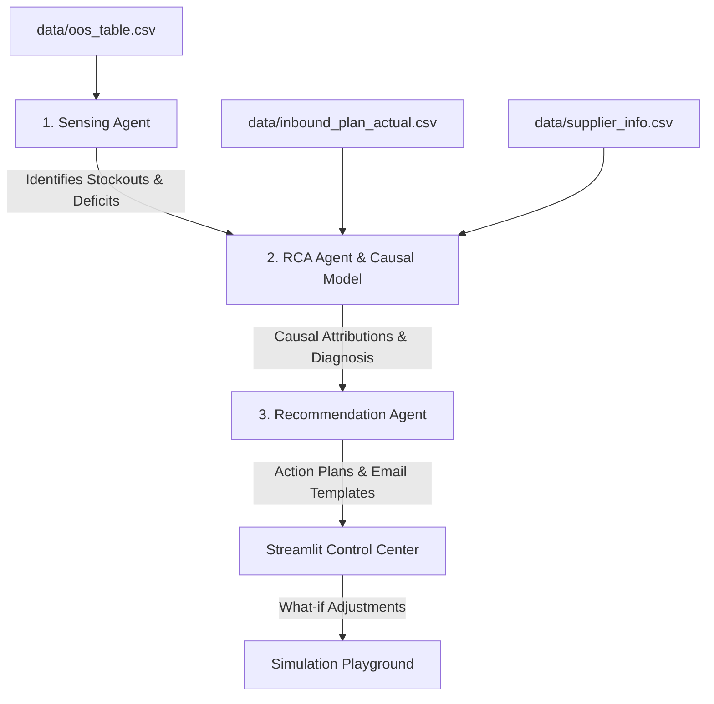

# AI Out-of-Stock (OOS) Agent Control Center

An enterprise-grade, multi-agent supply chain platform designed to autonomously detect out-of-stock risks, perform root cause analysis (RCA) using a quantitative causal model, and recommend mitigation plans (including automated email drafts for supplier communication).

The platform features a **Streamlit Dashboard** containing interactive inventory projection charts, causal breakdown donut charts, agent-generated actions, and a live simulation playground.

---

## 🏗️ System Architecture

The control center operates as a three-agent pipeline that sequentially processes supply chain metrics:



1. **Sensing Agent**: Scans the 25-week horizon for closing stock levels that drop below safety stock thresholds.
2. **RCA Agent & Causal Model**: Computes mathematical causal attributions (Demand Surge vs. Supply Deficits) and passes them to GPT-4o-mini to write a plain-language executive explanation.
3. **Recommendation Agent**: Formulates a detailed mitigation plan (standard reorders, PO expediting, or inter-warehouse transfers) and drafts communication templates.

---

## 🧮 Mathematical Causal Model

To avoid LLM hallucination and ensure auditability, the platform uses a quantitative causal attribution framework to distribute the drivers of a stockout at week $W_{stockout}$:

### 1. Demand Spike Driver ($C_{demand}$)
Attributes stockouts to sales/demand forecasts that exceed baseline current week (CW) levels:
$$C_{demand} = \max\left(0, \sum_{w=\text{CW}}^{W_{\text{stockout}}} \text{Forecast}_w - (\text{Forecast}_{\text{CW}} \times N)\right)$$
*(where $N$ is the number of weeks in the stockout window).*

### 2. Historical Supply Failure ($C_{supply\_hist}$)
Attributes starting inventory shortfalls at CW to past supplier delivery performance:
$$C_{supply\_hist} = \min\left(\max(0, \text{Safety Stock} - \text{Opening CW}), \sum_{w=\text{H1}}^{\text{H4}} (\text{Planned Inbound}_w - \text{Actual Inbound}_w)\right)$$

### 3. Future Planned Supply Gap ($C_{supply\_future}$)
Attributes stockouts to structural deficits where baseline demand exceeds planned replenishment:
$$C_{supply\_future} = \max\left(0, (\text{Forecast}_{\text{CW}} \times N) - \sum_{w=\text{CW}}^{W_{\text{stockout}}} \text{Inbound Supply}_w\right)$$

### 4. Lead Time Actionability Constraint
If the supplier's standard lead time (weeks) exceeds the weeks remaining to $W_{stockout}$, the replenishment window is flagged as **closed (constrained)**, directing the Recommendation Agent to search for immediate alternatives (warehouse transfers, air freight).

---

## 📂 Project Directory Structure

```
.
├── .env                       # OpenAI API credentials (git-ignored)
├── .gitignore                 # File exclusion list
├── README.md                  # Project documentation (this file)
├── generate_mock_data.py      # Generates realistic data sets
├── sensing_agent.py           # Core Sensing Agent logic
├── causal_model.py            # Mathematical Causal Model equations
├── rca_agent.py               # RCA Agent (GPT-4o-mini interface)
├── recommendation_agent.py    # Recommendation Agent (Action/JSON interface)
├── app.py                     # Streamlit application dashboard
│
└── data/                      # Simulation Data files
    ├── oos_table.csv          # 25-week supply chain horizon table
    ├── supplier_info.csv      # Safety stock thresholds and lead times
    └── inbound_plan_actual.csv # Historical delivery plan vs actual attainment
```

---

## 🚀 Getting Started

### 1. Clone & Install Dependencies
Ensure you have Python 3.9+ installed, then install the required Python packages:
```bash
pip install streamlit openai pandas numpy plotly
```

### 2. Configure Credentials
Create a `.env` file in the root directory and add your OpenAI API Key:
```env
OPENAI_API_KEY=your-api-key-here
OPENAI_MODEL=gpt-4o-mini
```

### 3. Generate Mock Data
Generate the sample CSV files containing stockout scenarios:
```bash
python generate_mock_data.py
```

### 4. Launch the Dashboard
Run the Streamlit control center locally:
```bash
streamlit run app.py
```
Open **[http://localhost:8501](http://localhost:8501)** in your browser.

---

## 🎮 Interactive Simulation Playground
Inside the dashboard, you can use the **Simulation tab** to adjust future planned inbound supply. The engine rolls inventory forward on the fly using:
$$\text{Closing Stock}_w = \text{Opening Stock}_w + \text{Inbound Supply}_w - \text{Forecast}_w$$
$$\text{Opening Stock}_{w+1} = \max(0, \text{Closing Stock}_w)$$

The system will instantly re-evaluate your changes and show if the stockout is resolved!
